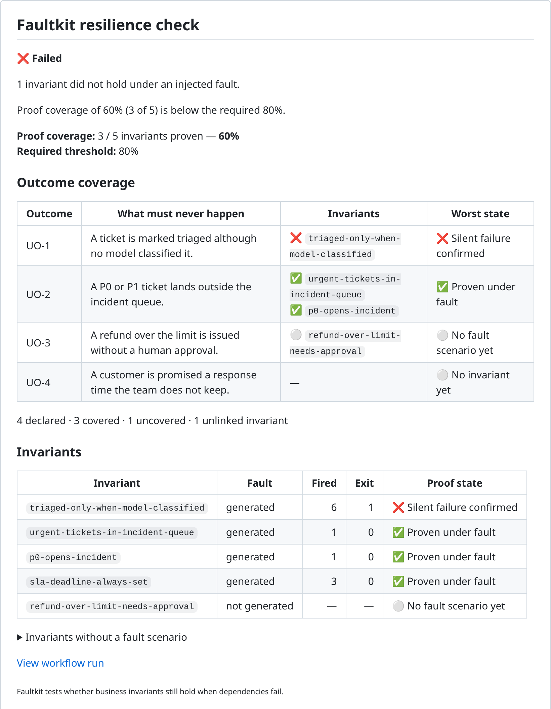

# faultkit/action

Prove on every pull request that your AI workflow still keeps its business
rules when a dependency fails.

[](https://github.com/faultkit/action/actions/workflows/ci.yml)
[](LICENSE)

The [faultkit skill](https://github.com/faultkit/skills) finds the rules an
AI workflow must never break. These rules are called invariants; one example
is "a ticket is stored as triaged only when the model classified it". For
each invariant, the skill records two things: the fault that tests it (a 503
from the model provider, say) and the test that checks it. This action
replays those records in CI with [faultkit](https://github.com/faultkit/faultkit).
It injects each fault, runs the matching test, and fails the build when an
invariant no longer holds.

> The agent discovers the invariant once. Faultkit deterministically proves
> it on every relevant CI run.

<picture>
  <source media="(prefers-color-scheme: dark)" srcset="assets/pr-comment-dark.png">
  
</picture>

<sub>The comment on a sample pull request. The PR's new fallback stored a
ticket as triaged on a keyword guess whenever the model call failed.</sub>

## How it works

1. **Download.** The action fetches the one faultkit release it pins
   (v0.1.3) and checks the archive against the sha256 embedded in the action.
   Nothing unverified runs.
2. **Read.** It loads `.faultkit/invariants/manifest.json`. Each invariant
   there names a fault scenario and a gate. The gate is the test command
   that shows whether the invariant held.
3. **Prove.** It runs `faultkit run` once per invariant. faultkit injects the
   fault while the gate runs, and writes a report of what fired.
4. **Judge.** Each invariant gets a proof state. The score is the share of
   all invariants that were proven.
5. **Report.** The log gets a table and the job summary gets a report. With
   a token, the pull request also gets one comment, updated in place on every
   push. Last come the step outputs and the exit code.

### Proof states

| State in the log | In the PR comment | Meaning | Effect on the run |
|---|---|---|---|
| `invariant proven under fault` | ✅ Proven under fault | The fault fired and the gate passed. | Counts toward the score. |
| `silent failure confirmed` | ❌ Silent failure confirmed | The fault fired and the gate failed: the invariant broke. | Fails the run at any threshold. |
| `invalid evidence: nothing was injected` | ⚠️ Invalid evidence: nothing was injected | The gate ran, but the fault never fired, so nothing was proven. | Fails the run at any threshold. |
| `fault not generated` | ⚪ No fault scenario yet | The invariant is known, but no deterministic fault could be built for it. | Lowers the score. |
| `error: …` | 🛑 error: … | faultkit could not produce evidence: it could not start, exited with an error, or wrote no valid report. | Fails the run at any threshold. |

A problem with the manifest, an input, or the binary also ends the run with
`result: error`, before any invariant runs.

## Before you start

The action replays invariants; it does not discover them. The manifest
comes from the faultkit skill. In Claude Code:

```text
/plugin marketplace add faultkit/skills
/plugin install faultkit@faultkit
/faultkit:prove-all
```

When `/faultkit:prove-all` asks where to keep the proofs, choose the
project. The skill writes the manifest and one scenario file per invariant
into `.faultkit/invariants/`, and adds any missing gate tests to your test
suite. Commit both.

The gates are your project's own tests. Your CI job must install what they
need before the action runs.

## Quick start

```yaml
# .github/workflows/faultkit.yml
name: Faultkit

on:
  pull_request:

permissions:
  contents: read
  pull-requests: write # only for the PR comment

jobs:
  resilience:
    runs-on: ubuntu-latest
    timeout-minutes: 15

    steps:
      - uses: actions/checkout@3d3c42e5aac5ba805825da76410c181273ba90b1 # v7.0.1
        with:
          persist-credentials: false

      # Install what your gates need first, e.g. actions/setup-node + npm ci,
      # or actions/setup-python + pip install -r requirements.txt.

      - name: Prove resilience invariants
        uses: faultkit/action@48f7baf9cedc33be5d4afeb4d9fd9b92f686b912 # v1.0.0
        with:
          threshold: 100
          github-token: ${{ github.token }}
```

The example pins v1.0.0 by its full commit SHA. A tag can be moved to other
code; a commit SHA cannot. To upgrade, copy the example again from this
README, or take the commit of the newest
[release](https://github.com/faultkit/action/releases).

To skip the PR comment, drop `pull-requests: write` and `github-token`. The
job summary and the exit code still carry the full result:

```yaml
permissions:
  contents: read

# ...

      - name: Prove resilience invariants
        uses: faultkit/action@48f7baf9cedc33be5d4afeb4d9fd9b92f686b912 # v1.0.0
        with:
          threshold: 80
```

Both examples trigger on `pull_request`, never on `pull_request_target`. See
[Security](#security) for why.

## What you get

- **The job log.** One section per invariant that runs, with faultkit's and
  the gate's output, then the prove-all table and the verdict. A failed run ends with an error annotation such as
  `faultkit: failed: 3/5 proven (60%), threshold 80%`.

  ```text
  === prove-all ===

  invariant                           fault          fired  exit  proof state
  triaged-only-when-model-classified  generated          6     1  silent failure confirmed
  urgent-tickets-in-incident-queue    generated          1     0  invariant proven under fault
  sla-deadline-always-set             generated          3     0  invariant proven under fault
  p0-opens-incident                   generated          1     0  invariant proven under fault
  refund-over-limit-needs-approval    not-generated      -     -  fault not generated
  ```

- **The job summary.** The same report as the PR comment. It is always
  written, with or without a token.
- **The PR comment.** One per pull request, found again by a hidden marker
  and updated in place on every push. [Security](#security) explains which
  comments the action updates.
- **Reports.** faultkit's `report/v1` file for each invariant, at
  `.faultkit/reports/<id>.report.json`. To keep them, upload that directory
  with `actions/upload-artifact`.
- **Step outputs and the exit code.** The step fails unless `result` is
  `passed`.

## Declared outcomes

The skill can also keep `.faultkit/values.md`: the business value and the
outcomes a team says must never happen, each with an id such as `UO-1`.
Manifest version 3 links each invariant to the outcome it protects. When the
action finds a values file, the job summary and the PR comment open with an
**Outcome coverage** block. It has one row per declared outcome, with the
outcome's text, the invariants that protect it and their states, and the
worst of those states. An outcome that no invariant names shows ⚪ No
invariant yet. The log prints the same table as the skill's helper:

```text
=== outcomes ===
outcome  worst state               invariants
UO-1     silent failure confirmed  fallback-never-triaged
                                   revenue-stopped-always-pages
UO-2     no invariant yet          -
declared 2, covered 1, uncovered 1, unlinked invariants 0
```

The action looks for the file in this order: the `values` input, the
manifest's `values`, and `.faultkit/values.md`. With no file, it skips
coverage, unless `require-values` is `true`. Coverage doesn't change the
verdict unless `fail-on-uncovered` is `true`; then an uncovered outcome
fails the run like a threshold miss. Every outcome link is checked before
anything runs: a link to an outcome the file doesn't declare, or a link with
no values file, is an error.

## Inputs

All inputs are optional.

| Input | Description | Default |
|---|---|---|
| `manifest` | Path to the invariant manifest, relative to the repository root. | `.faultkit/invariants/manifest.json` |
| `threshold` | Minimum proof score from 0 to 100: proven invariants over all known invariants, including those with no generated fault. A silent failure, invalid evidence, or an error fails the run at any threshold. | `100` |
| `github-token` | Used only to create or update the PR comment. Without it, there is no comment. | none |
| `faultkit-path` | Run this faultkit binary instead of downloading the release this action pins. | none |
| `values` | Path to the values file, relative to the repository root. | the manifest's `values`, else `.faultkit/values.md` |
| `require-values` | `true` to stop with an error, before anything runs, when no values file is found. | `false` |
| `fail-on-uncovered` | `true` to fail the run, like a threshold miss, when a declared outcome has no invariant. | `false` |

## Outputs

| Output | Description |
|---|---|
| `result` | `passed`, `failed`, or `error`. |
| `score` | Proven invariants as a percentage of all known invariants, rounded to 2 decimals. |
| `threshold` | The threshold the score was compared with. |
| `total` | Invariants in the manifest. |
| `proven` | Invariants proven under fault. |
| `failed` | Invariants with a confirmed silent failure. |
| `invalid` | Invariants whose fault was never injected. |
| `not-generated` | Invariants with no generated fault scenario. |
| `reports-directory` | Where the faultkit report/v1 files are, relative to the repository root. |
| `outcomes` | Outcomes declared in the values file; `0` without one. |
| `covered` | Declared outcomes that at least one invariant names. |
| `uncovered` | Declared outcomes that no invariant names. |

## Threshold

The score is proven invariants divided by all known invariants. Invariants
without a generated fault count in the total, so they lower the score (see
[Manifest](#manifest)). A run passes only when all of the following hold:

- There is no silent failure.
- There is no invalid evidence.
- There is no error.
- The score reaches the threshold.

`threshold: 100`, the default, means every known invariant must have a
generated scenario and be proven.

`threshold: 80` lets up to 20% of known invariants lack fault coverage. For
example, 4 proven out of 5 known passes.

No threshold, not even `0`, lets a silent failure, invalid evidence, or an
error pass.

## Manifest

The manifest lists every invariant the skill has found, whether or not a
deterministic fault scenario could be built for it.

- **Version 1** lists only invariants that already have a scenario. The
  action treats every entry as generated. A `fault_status` field in a
  version 1 manifest is an error.
- **Version 2** adds `fault_status`, which each entry sets to `generated` or
  `not_generated`.
- **Version 3** adds outcome links. Each entry may name the outcome it
  protects, as `"outcome": "UO-1"`, and the top level may set `values`, the
  values file's path relative to the repository root, which must stay inside
  it. `registry` and an entry's `source` are reserved for vendored registry
  scenarios. A `source` carries the sha256 of its `config` file, which the
  action checks offline before anything runs. A version 3 field in a version
  1 or 2 manifest is an error.

A `generated` invariant needs a `gate`: the test command, as a list of
arguments. It also needs exactly one of `config` (a scenario file) or
`scenario` (a builtin faultkit scenario):

```json
{
  "version": 2,
  "invariants": [
    {
      "id": "paid-invoice-never-escalated",
      "invariant": "A paid invoice is never sent to collections.",
      "shape": "S3",
      "fault_status": "generated",
      "config": "paid-invoice-never-escalated.yaml",
      "base_url": false,
      "mode": "auto",
      "gate": ["pytest", "-q", "tests/test_paid_invoice.py"]
    }
  ]
}
```

A `not_generated` invariant has no `config`, no `scenario`, and needs no
gate. It needs a `fault_reason` instead, saying why no deterministic fault
could be built:

```json
{
  "id": "human-approval-is-always-recorded",
  "invariant": "Every regulated action has a recorded human approval.",
  "shape": "S8",
  "fault_status": "not_generated",
  "fault_reason": "No deterministic injectable boundary was identified."
}
```

Two rules apply to scenarios:

- **`config` stays inside the manifest's directory.** It is a relative path,
  and it must resolve inside that directory after symlinks are resolved. An
  absolute path, a `..` escape, or a symlink that points outside fails the
  manifest.
- **Prefer `config` over a builtin `scenario` for proofs.** A builtin
  `scenario:` fires probabilistically, so a run can end as invalid evidence
  just because the fault didn't fire that time. For a proof, use a `config`
  scenario with `probability: 1.0`.

## Security

- **Pin the action to a full commit SHA.** A tag or a branch can move; a
  commit SHA cannot.
- **Use `pull_request`, never `pull_request_target`.** The gate runs the
  pull request's code. Under `pull_request_target`, that code would run
  while the workflow holds a write token and the repository's secrets.
- **The gate's environment is scrubbed, but it is not a sandbox.** faultkit
  and the gate run without:
  - the action's inputs, which include the `github-token`,
  - the runner's `ACTIONS_*` tokens,
  - this step's workflow files: `GITHUB_OUTPUT`, `GITHUB_STEP_SUMMARY`,
    `GITHUB_STATE`, `GITHUB_ENV`, `GITHUB_PATH`.

  That keeps the token out of casual reach, but the gate runs as the same
  user as the action. The real protection is the trigger: on
  `pull_request`, a fork's token is read-only and secrets are withheld. Keep
  `persist-credentials: false` on the checkout step. Otherwise the job token
  is written to `.git/config`, where the gate could read it.
- **Only a bot's comment is ever updated.** Anyone can comment on a pull
  request. The action therefore updates only the first comment that carries
  its hidden marker and was written by a bot account. That can be any bot,
  not only this action. Use the workflow's `github.token` or a GitHub App
  token. A personal access token comments as a person, so its earlier
  comment never matches, and the action posts a new comment on every run.
- **All jobs on a pull request share one comment.** If several jobs or
  workflows run this action on the same pull request, the last one to
  finish overwrites the others. Pass `github-token` from one job only. A
  `concurrency:` group on the workflow stops two runs from each creating a
  comment.
- **`faultkit-path` bypasses the sha256 pin.** Use it only with a binary you
  trust. On `pull_request`, a path inside the checkout is controlled by the
  pull request.

## Network

- **The action reaches two places.** One is the pinned faultkit release. The
  other is the GitHub API for the PR comment, and only when `github-token`
  is set. There is no telemetry.
- **The release download redirects.** It starts at github.com and redirects
  to GitHub's release-asset host. An egress allowlist, including on GHES,
  must permit both.
- **The gate keeps its own network access.** The gate is your application;
  the action does not restrict what it can reach.

## Limits

- **Windows runners are not supported.** faultkit ships Linux and macOS
  binaries for amd64 and arm64. On any other platform, the run fails with an
  error as soon as a generated invariant needs the binary.
- **Invariants with `mode: ebpf` need a privileged runner.** Without one,
  faultkit exits with an error, and the invariant's row shows that error. It
  never passes silently.
- **There is no per-invariant timeout.** Set the job's `timeout-minutes`, as
  the examples do.
- **The comment and the summary have size caps.** GitHub limits them to
  60,000 and 1,000,000 UTF-8 bytes. Past 25 invariants, the full table
  collapses into a `<details>` block, and the rows that need attention stay
  above it. If a report would still exceed its cap, the rows that need
  attention are kept first and the rest become "…and N more". The full list
  is always in the job log. An error message inside the Markdown is cut at
  2,000 characters.

## Updating the pinned faultkit

The action pins one faultkit version and never resolves `latest`. To move
the pin to a new release:

1. Download that release's `checksums.txt` and `checksums.txt.sigstore.json`.
2. Verify them with cosign v2.4 or newer:
   ```shell
   cosign verify-blob \
     --bundle checksums.txt.sigstore.json \
     --certificate-identity cenk.kalpakoglu@gmail.com \
     --certificate-oidc-issuer https://accounts.google.com \
     checksums.txt
   ```
3. Copy the four sha256 values (`linux-amd64`, `linux-arm64`,
   `darwin-amd64`, `darwin-arm64`) into `src/binary.js`.
4. In `src/binary.js`, bump `FAULTKIT_VERSION` and the asset file names.
5. Release a new version of this action.

[docs/architecture.md](docs/architecture.md) describes the design and what
the action deliberately leaves out. To report a vulnerability, see
[SECURITY.md](SECURITY.md).

## License

Apache-2.0, like [faultkit](https://github.com/faultkit/faultkit).
